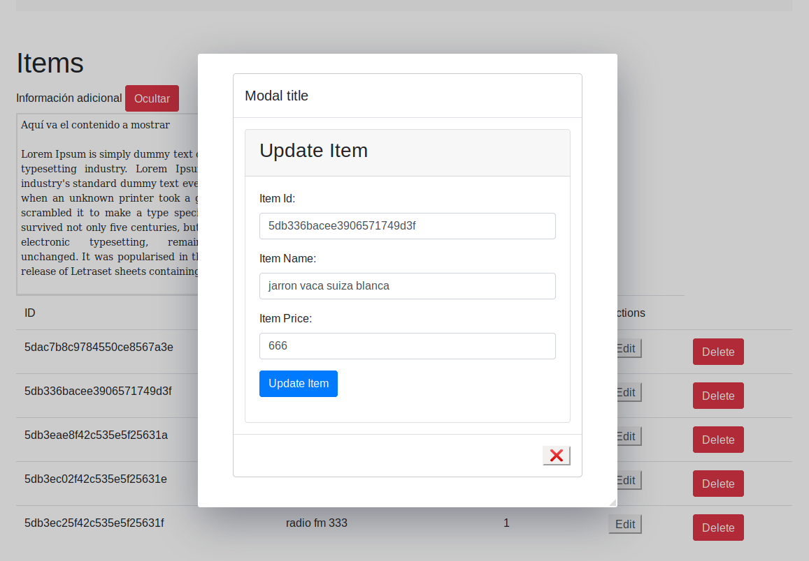

# vue-js-modal-crud-
CRUD- Con vuejs,  vue-js-modal, mongodb, bootstrap
Hay 2 ejemplos de modales: 
  * Uno utilizando la libreria  : vue-js-modal 
    https://www.npmjs.com/package/vue-js-modal
  * Otro utilizando la clase modal de bootstrap

